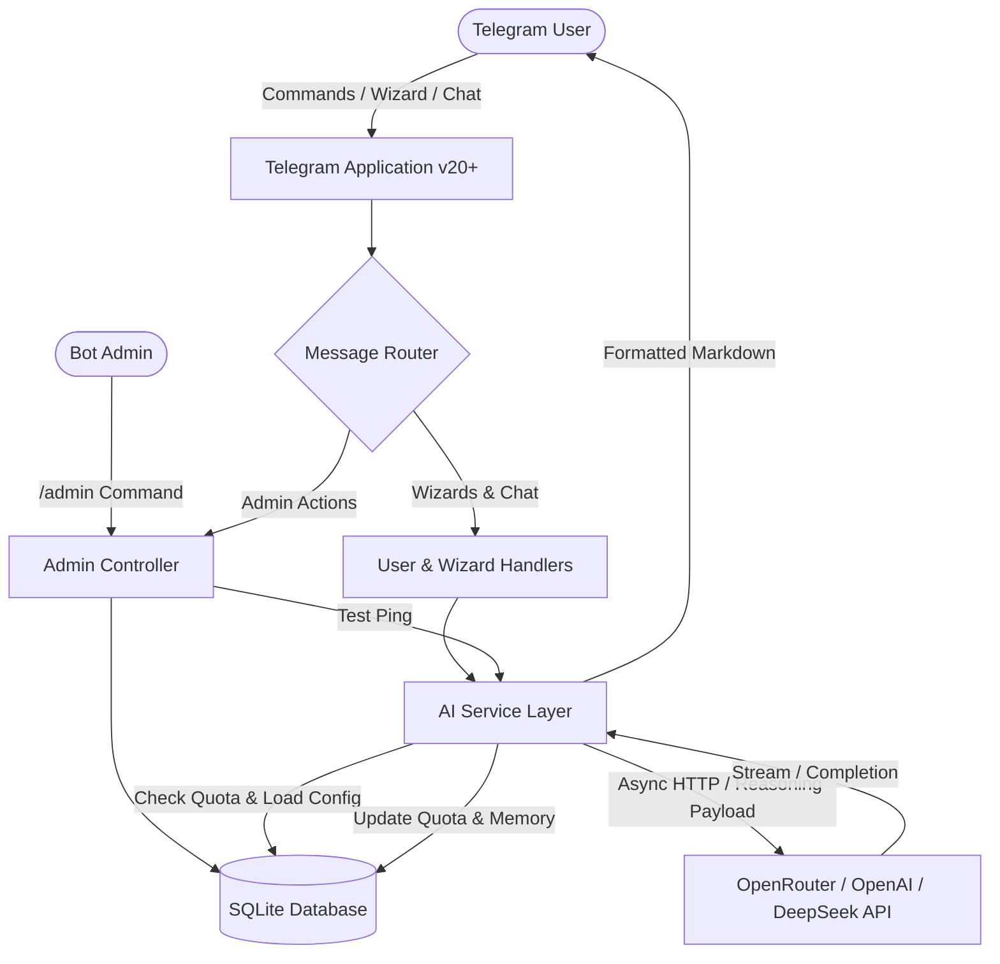

# 🌿 TelegramAgriBot — AI Agricultural Consultant

[](https://www.python.org/)
[](LICENSE)
[](https://core.telegram.org/bots/api)
[](https://www.docker.com/)

> **TelegramAgriBot** is a production-ready, asynchronous AI-powered Agricultural Consultant bot for Telegram. Built with modern `python-telegram-bot` v20+ and custom LLM integration, it provides farmers, agronomists, and gardeners with expert guidance on crop management, pest & disease diagnosis, irrigation schedules, and soil nutrition.
>
> 🌐 *This document is bilingual: [English Section](#-english-documentation) | [بخش فارسی](#-راهنمای-فارسی-persian-documentation)*

---

## 📑 Table of Contents / فهرست مطالب
1. [English Documentation](#-english-documentation)
   - [Key Features](#-key-features)
   - [Interactive Agricultural Wizards](#-interactive-agricultural-wizards)
   - [Admin Control & In-Bot AI Config](#-admin-control--in-bot-ai-configuration)
   - [Architecture & Tech Stack](#-architecture--tech-stack)
   - [Installation & Quick Start](#-installation--quick-start)
   - [Docker Deployment](#-docker-deployment)
   - [Environment Variables](#-environment-variables)
   - [Bot Commands](#-bot-commands)
2. [راهنمای فارسی (Persian Documentation)](#-راهنمای-فارسی-persian-documentation)
   - [معرفی پروژه](#-معرفی-پروژه)
   - [امکانات کلیدی](#-امکانات-کلیدی)
   - [پنل مدیریت هوش مصنوعی در تلگرام](#-پنل-مدیریت-هوش-مصنوعی-در-تلگرام)
   - [نصب و راه‌اندازی سریع](#-نصب-و-راه‌اندازی-سریع)
   - [استقرار با داکر (Docker)](#-استقرار-با-داکر-docker)
   - [جدول متغیرهای محیطی](#-جدول-متغیرهای-محیطی)

---

# 🇬🇧 English Documentation

## 🌟 Key Features

- **🌐 English User Interface**: Clean, professional English language interface with intuitive inline buttons and structured responses.
- **🤖 Dynamic AI Provider Integration**: Compatible with OpenRouter, OpenAI, DeepSeek, LocalLLMs, or any OpenAI-compatible Chat Completions API.
- **🧠 Advanced Reasoning Support**: Toggleable support for reasoning-enabled models (e.g., DeepSeek-R1, OpenRouter reasoning models) sending `{"reasoning": {"enabled": true}}` in the request payload.
- **📊 Quotas & Cost Protection**: Set maximum request limits (`Chatbot Max Requests`), view real-time consumption (`Used / Remaining`), and reset counters in one click.
- **⚡ In-Bot Live AI Configuration**: Admins can update Provider Name, Model Name, Endpoint URL, and API Key directly inside Telegram with zero downtime.
- **🌾 Interactive Agricultural Wizards**: Step-by-step guided flows for crops, pests, irrigation, fertilizers, and seasonal farming tips.
- **💬 Conversational Memory**: Context-aware multi-turn conversations for natural follow-up questions.
- **💾 SQLite Persistence**: Safe, persistent storage for AI settings, user data, request quotas, and chat memory.
- **🐳 Docker & Docker Compose Ready**: Easily deploy on VPS or cloud servers with persistent data volumes.

---

## 🌾 Interactive Agricultural Wizards

| Service | Description |
| :--- | :--- |
| **🌾 Crop & Soil Advisory** | 3-step wizard (Soil Type → Climate → Target Crop) recommending crop varieties, sowing depth, spacing, and soil prep. |
| **🐛 Pest & Disease Diagnosis** | Symptom analysis offering cultural, organic/biological, and chemical treatment plans. |
| **💧 Irrigation & Water** | Customized irrigation schedules (Drip, Sprinkler, Flood, Rainfed) to save water and maximize yield. |
| **🧪 Fertilizer & Nutrition** | N-P-K nutrient balancing, organic compost guidance, and deficiency correction. |
| **🌦️ Seasonal & Weather Tips** | Climate-specific protective tips against frost, heat stress, and seasonal transitions. |
| **💬 Direct AI Chat** | Free-form agronomy Q&A with continuous conversation memory. |

---

## ⚙️ Admin Control & In-Bot AI Configuration

Administrators (configured via `ADMIN_IDS` in `.env`) can access the dynamic admin dashboard anytime by typing `/admin`:

```text
⚙️ AgriBot Administration & AI Config

🏷️ Provider Name: OpenRouter
🤖 Model Name: openrouter/free
🌐 API URL: https://openrouter.ai/api/v1/chat/completions
🔑 API Key: sk-or-••••••••••••34a1

🧠 Enable Advanced Reasoning: 🟢 Enabled
   (Sends {"reasoning": {"enabled": true}} in payload)

📊 Quotas & Limits:
   • Max Requests: 50
   • Used: 3
   • Remaining: 47

[🏷️ Provider: OpenRouter]  [🤖 Model: openrouter/free]
[🌐 Endpoint API URL]     [🔑 Update API Key]
[🧠 Advanced Reasoning: 🟢 Enabled]
[📊 Quotas & Limits (3/50)] [⚡ Test AI Connection]
[📈 System Statistics]    [❌ Exit Admin Panel]
```

### Admin Capabilities:
1. **Change Provider & Model**: Switch between `OpenRouter`, `OpenAI`, `DeepSeek`, `anthropic/claude-3.5-sonnet`, `deepseek/deepseek-r1`, `openai/gpt-4o-mini`, etc.
2. **Update Endpoint API URL**: Set custom URLs (e.g. `https://openrouter.ai/api/v1/chat/completions`).
3. **Secure API Key Management**: Update API keys instantly. The key is securely masked in the UI and incoming key messages are deleted from chat for security.
4. **Toggle Advanced Reasoning**: Switch reasoning payload on/off with a single click.
5. **Manage Quotas**: Set maximum request limits to prevent unexpected costs and reset usage counters whenever needed.
6. **Test AI Connection**: Send a real-time test ping to verify credentials and endpoint health immediately.
7. **View Analytics**: View total registered users, total queries, and quota statistics.

---

## 🏗️ Architecture & Tech Stack



- **Runtime**: Python 3.10+
- **Bot Framework**: `python-telegram-bot` (v20.7+) Async API
- **HTTP Client**: `httpx` (Asynchronous connection pooling)
- **Database**: SQLite3 (Thread-safe persistent storage)
- **Deployment**: Docker & Docker Compose

---

## 🚀 Installation & Quick Start

### 1. Clone the repository
```bash
git clone https://github.com/your-username/TelegramAgriBot.git
cd TelegramAgriBot
```

### 2. Create a Virtual Environment & Install Dependencies
```bash
python -m venv venv
# On Linux/macOS:
source venv/bin/activate
# On Windows:
venv\Scripts\activate

pip install -r requirements.txt
```

### 3. Configure Environment Variables
Copy the example environment file:
```bash
cp .env.example .env
```
Edit `.env` and fill in your details:
```env
TELEGRAM_BOT_TOKEN=123456789:ABCdefGhIJKlmNoPQRsTUVwxyZ
ADMIN_IDS=123456789
DEFAULT_API_KEY=sk-or-v1-your-openrouter-key
```
> 💡 *To get your Telegram User ID, send `/id` to `@userinfobot` or `@raw_data_bot` on Telegram.*

### 4. Run the Bot
```bash
python main.py
```

---

## 🐳 Docker Deployment

For 24/7 server deployment with automatic restarts:

```bash
# 1. Build and start container in the background
docker compose up -d --build

# 2. View live logs
docker compose logs -f

# 3. Stop container
docker compose down
```

---

## 📋 Environment Variables

| Variable | Required | Default | Description |
| :--- | :---: | :---: | :--- |
| `TELEGRAM_BOT_TOKEN` | **Yes** | — | Bot token from [@BotFather](https://t.me/BotFather) |
| `ADMIN_IDS` | **Yes** | — | Comma-separated Telegram User IDs allowed to access `/admin` |
| `DEFAULT_PROVIDER_NAME` | No | `OpenRouter` | Default AI provider label |
| `DEFAULT_MODEL_NAME` | No | `openrouter/free` | Default model identifier |
| `DEFAULT_API_URL` | No | `https://openrouter.ai/api/v1/chat/completions` | Chat completions API endpoint |
| `DEFAULT_API_KEY` | No | `""` | Initial AI Bearer API token |
| `ENABLE_ADVANCED_REASONING` | No | `false` | Enable `{"reasoning": {"enabled": true}}` payload |
| `DEFAULT_MAX_REQUESTS` | No | `50` | Max total AI requests before quota limit (`0` for unlimited) |
| `DATABASE_PATH` | No | `agribot.db` | Path to SQLite database file |

---

## 🤖 Bot Commands

| Command | Permission | Description |
| :--- | :---: | :--- |
| `/start` | All Users | Start the bot, register profile, and display main services menu |
| `/menu` | All Users | Open the agricultural services menu |
| `/clear` | All Users | Reset and clear conversation memory |
| `/help` | All Users | View user guide and tips for asking questions |
| `/admin` | **Admins Only** | Access the live AI configuration and quota management dashboard |

---
---

# 🇮🇷 راهنمای فارسی (Persian Documentation)

## 🌾 معرفی پروژه

**TelegramAgriBot** یک ربات مشاور و کارشناس هوش مصنوعی کشاورزی پیشرفته، ماژولار و بر پایه متدهای ناهمگام (Async) پایتون است. این ربات با اتصال به مدل‌های هوش مصنوعی (مانند OpenRouter، DeepSeek، OpenAI و مدل‌های زبانی دیگر)، راهکارهای تخصصی، علمی و کاربردی را در حوزه زراعت، باغبانی، کنترل آفات، کوددهی و آبیاری در اختیار کاربران قرار می‌دهد.

تمامی پیام‌ها، دکمه‌ها و تعاملات کاربری ربات به **زبان انگلیسی** طراحی شده است تا استانداردهای بین‌المللی را حفظ کند.

---

## 🚀 امکانات کلیدی

- **طراحی زیبا و دکمه‌های شیشه‌ای (Inline Keyboards)**: منوی تعاملی و کاربرپسند برای دسترسی به خدمات مختلف.
- **اتصال به انواع ارائه‌دهندگان هوش مصنوعی**: پشتیبانی از OpenRouter، OpenAI، DeepSeek و تمامی سرویس‌های سازگار با استاندارد OpenAI Chat Completions.
- **پشتیبانی از استدلال پیشرفته (Advanced Reasoning)**: ارسال فلگ `{"reasoning": {"enabled": true}}` برای مدل‌های دارای زنجیره تفکر (مانند DeepSeek R1).
- **مدیریت سهمیه و سقف هزینه (Quotas & Limits)**: قابلیت تعیین حداکثر درخواست مجاز، نمایش درخواست‌های مصرف‌شده و باقیمانده، و دکمه بازنشانی (Reset) در پنل مدیریت.
- **تنظیم زنده مشخصات هوش مصنوعی از تلگرام**: امکان تغییر نام ارائه‌دهنده، نام مدل، آدرس اندپوینت (URL)، و توکن API مستقیماً از داخل تلگرام توسط ادمین بدون نیاز به ری‌استارت سرور.
- **ویزاردهای گام‌به‌گام کشاورزی**:
  - 🌾 **مشاوره کشت و خاک (Crop Advisory)**: انتخاب محصول بر اساس نوع خاک و اقلیم.
  - 🐛 **تشخیص آفات و بیماری‌ها (Pest Diagnosis)**: بررسی علائم و ارائه درمان‌های ارگانیک، تلفیقی (IPM) و شیمیایی.
  - 💧 **مدیریت آبیاری (Irrigation)**: تنظیم دور و روش آبیاری (قطره‌ای، بارانی، غرقابی).
  - 🧪 **محاسبه کود و تغذیه (Fertilizer Calculator)**: توصیه نسبت N-P-K، کودهای آلی و رفع کمبودها.
  - 🌦️ **توصیه‌های فصلی و اقلیمی (Seasonal Tips)**: راهکارهای محافظت در برابر تنش‌های سرمایی و گرمایی.
  - 💬 **چت آزاد با هوش مصنوعی**: پرسش و پاسخ پیوسته با حفظ حافظه مکالمه.
- **پایگاه داده پایدار SQLite**: ذخیره‌سازی دائمی تنظیمات، آمار کاربران، مصرف و حافظه گفتگو.
- **پشتیبانی کامل از داکر (Docker)**: استقرار سریع و پایدار روی سرور با Docker Compose.

---

## 🛠️ پنل مدیریت هوش مصنوعی در تلگرام

ادمین‌هایی که شناسه کاربری (User ID) آن‌ها در متغیر `ADMIN_IDS` مشخص شده است، می‌توانند با ارسال دستور `/admin` به داشبورد مدیریتی دسترسی پیدا کنند:

### گزینه‌های قابل تنظیم در پنل:
1. **🏷️ Provider Name**: تغییر نام ارائه‌دهنده (مثلاً `OpenRouter`، `OpenAI`، `DeepSeek`).
2. **🤖 Model Name**: تغییر مدل فعال (مثلاً `openrouter/free`، `deepseek/deepseek-r1`، `openai/gpt-4o-mini`، `anthropic/claude-3.5-sonnet`).
3. **🌐 Endpoint API URL**: تنظیم آدرس کامل اندپوینت (مانند `https://openrouter.ai/api/v1/chat/completions`).
4. **🔑 Update API Key**: دریافت توکن جدید با امنیت بالا (پیام ارسالی حاوی کلید فوراً از چت حذف شده و در پنل به صورت ماسک‌شده نمایش داده می‌شود).
5. **🧠 Advanced Reasoning**: فعال یا غیرفعال‌سازی ارسال فلگ استدلال با یک کلیک.
6. **📊 Quotas & Limits**: تعیین سقف مجاز درخواست‌ها (مثلاً 50 درخواست) و دکمه Reset سهمیه.
7. **⚡ Test AI Connection**: تست زنده اتصال به هوش مصنوعی و نمایش پیام سلامت اندپوینت.
8. **📈 System Statistics**: مشاهده تعداد کاربران ثبت‌شده، تعداد کل درخواست‌ها و وضعیت سیستم.

---

## 📦 نصب و راه‌اندازی سریع

### ۱. دریافت پروژه
```bash
git clone https://github.com/your-username/TelegramAgriBot.git
cd TelegramAgriBot
```

### ۲. ساخت محیط مجازی و نصب پیش‌نیازها
```bash
python -m venv venv

# لینوکس یا مک:
source venv/bin/activate

# ویندوز:
venv\Scripts\activate

pip install -r requirements.txt
```

### ۳. تنظیم متغیرهای محیطی
فایل `.env.example` را به `.env` کپی کنید:
```bash
cp .env.example .env
```
سپس مقادیر توکن ربات و شناسه ادمین را وارد کنید:
```env
TELEGRAM_BOT_TOKEN=توکن_دریافتی_از_بات‌فادر
ADMIN_IDS=شناسه_عددی_تلگرام_ادمین
DEFAULT_API_KEY=توکن_هوش_مصنوعی_اوپن_روتر
```
> 💡 *برای به دست آوردن شناسه عددی تلگرام خود، دستور `/id` را به ربات‌های `@userinfobot` یا `@raw_data_bot` در تلگرام ارسال کنید.*

### ۴. اجرای ربات
```bash
python main.py
```

---

## 🐳 استقرار با داکر (Docker)

برای اجرای همیشگی و خودکار ربات روی سرور:

```bash
# ساخت ایمیج و اجرای کانتینر
docker compose up -d --build

# مشاهده لاگ‌های زنده
docker compose logs -f

# متوقف کردن کانتینر
docker compose down
```

---

## ⚙️ جدول متغیرهای محیطی

| متغیر | الزامی؟ | مقدار پیش‌فرض | توضیح |
| :--- | :---: | :---: | :--- |
| `TELEGRAM_BOT_TOKEN` | **بله** | — | توکن دریافتی از [@BotFather](https://t.me/BotFather) |
| `ADMIN_IDS` | **بله** | — | شناسه‌های عددی ادمین‌ها با کاما (مثلاً `12345678,98765432`) |
| `DEFAULT_PROVIDER_NAME` | خیر | `OpenRouter` | نام اولیه سرویس‌دهنده هوش مصنوعی |
| `DEFAULT_MODEL_NAME` | خیر | `openrouter/free` | شناسه مدل اولیه هوش مصنوعی |
| `DEFAULT_API_URL` | خیر | `https://openrouter.ai/api/v1/chat/completions` | آدرس اندپوینت ارسال پیام به هوش مصنوعی |
| `DEFAULT_API_KEY` | خیر | `""` | کلید اولیه API (قابل تنظیم بعدی از داخل ربات) |
| `ENABLE_ADVANCED_REASONING` | خیر | `false` | فعال‌سازی ساختار استدلال در درخواست |
| `DEFAULT_MAX_REQUESTS` | خیر | `50` | سقف مجاز درخواست‌ها (مقدار `0` یعنی نامحدود) |
| `DATABASE_PATH` | خیر | `agribot.db` | مسیر ذخیره‌سازی فایل دیتابیس SQLite |

---

## 📄 لایسنس
این پروژه تحت مجوز [MIT](LICENSE) منتشر شده است.
